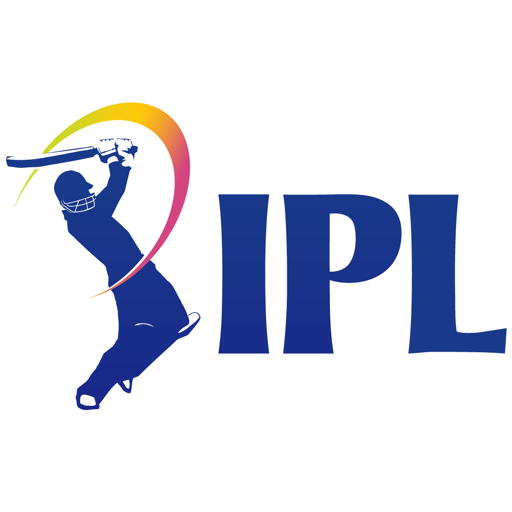
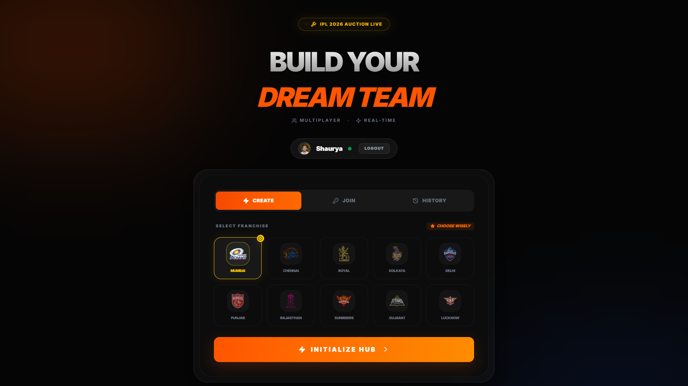
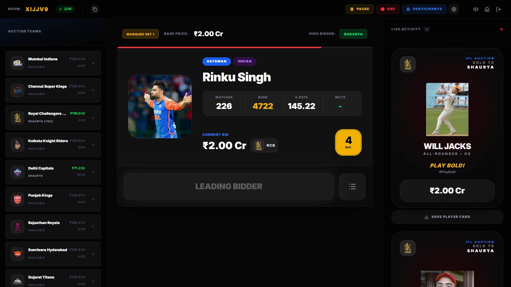
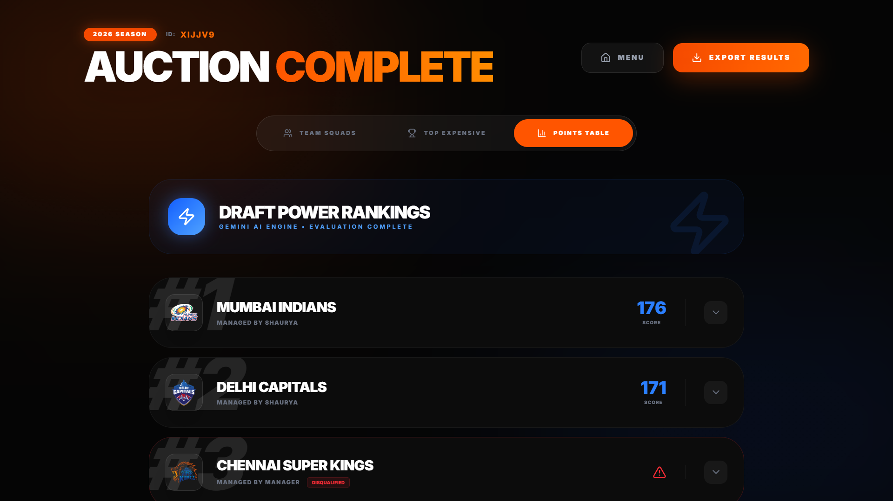

<div align="center">
  

  # 🏏 IPL Mega Auction
  ### *The Ultimate Real-Time SaaS Auction Experience*

  [](https://reactjs.org/)
  [](https://vitejs.dev/)
  [](https://tailwindcss.com/)
  [](https://firebase.google.com/)
  [](https://deepmind.google/technologies/gemini/)

  <p align="center">
    <b>A high-performance, real-time simulation platform designed to replicate the intensity and professional aesthetic of the official IPL auction.</b>
    <br />
    <a href="#-key-features">Key Features</a> •
    <a href="#-visual-showcase">Visual Showcase</a> •
    <a href="#-tech-stack">Tech Stack</a> •
    <a href="#-getting-started">Getting Started</a>
  </p>
</div>

---

## ✨ Key Features

<table align="center" width="100%">
  <tr>
    <td width="50%" valign="top">
      <h3>🏢 Enterprise Bidding Engine</h3>
      <ul>
        <li><b>Real-Time Sync:</b> Powered by Firebase for sub-second latency.</li>
        <li><b>Atomic Transactions:</b> Ensures data integrity for every bid.</li>
        <li><b>Smart Countdown:</b> Universal time sync for all participants.</li>
      </ul>
    </td>
    <td width="50%" valign="top">
      <h3>🧠 Gemini AI Engine</h3>
      <ul>
        <li><b>Squad Valuation:</b> Dynamic scoring based on player stats.</li>
        <li><b>Power Rankings:</b> Automated leaderboards for draft quality.</li>
        <li><b>Smart Guards:</b> 18-player minimum enforcement logic.</li>
      </ul>
    </td>
  </tr>
  <tr>
    <td width="50%" valign="top">
      <h3>📺 Broadcast UI/UX</h3>
      <ul>
        <li><b>Premium Design:</b> Dark mode with sleek glassmorphism.</li>
        <li><b>Dynamic Overlays:</b> Confetti and "SOLD" card animations.</li>
        <li><b>Infinite Marquee:</b> Branded landing for instant engagement.</li>
      </ul>
    </td>
    <td width="50%" valign="top">
      <h3>📊 Roster Management</h3>
      <ul>
        <li><b>Set-Wise Auction:</b> Chronological player groups and sets.</li>
        <li><b>History Log:</b> Full transparency on every acquisition.</li>
        <li><b>Results Export:</b> Professional summaries post-auction.</li>
      </ul>
    </td>
  </tr>
</table>

---

## 🖼 Visual Showcase

> [!TIP]
> This platform is optimized for large-scale displays and real-time multiplayer engagement.

<div align="center">
  
  <p><i>The high-fidelity landing experience with real-time room management.</i></p>
  
  <br />

  
  
  
  <div style="clear: both;"></div>
  
  <p align="center"><i>From high-stakes bidding (Left) to AI-powered results (Right).</i></p>
</div>

---

## 🛠 Tech Stack

- **Frontend Core:** `React 18` + `Vite` (Ultra-fast HMR)
- **Styling:** `Tailwind CSS v4` + `Framer Motion` (Broadcast Animations)
- **Real-time Backend:** `Firebase` (Auth, Firestore, Realtime DB)
- **AI Intelligence:** `Google Gemini API` (Squad Analysis)
- **Voice Chat:** `Agora RTC SDK` (Broadcast Integration)
- **Utilities:** `Lucide React`, `Canvas Confetti`, `html-to-image`

---

## 🚀 Getting Started

### Prerequisites
- Node.js (v18+)
- Firebase Project setup
- Gemini API Key (optional for AI features)

### Installation

1. **Clone & Install**
   ```bash
   git clone https://github.com/Shaurya01836/ipl-auction.git
   cd ipl-auction
   npm install
   ```

2. **Configure Environment**
   Create a `.env` file in the root with your credentials:
   ```env
   VITE_FIREBASE_API_KEY=your_key
   VITE_GEMINI_API_KEY=your_key
   VITE_AGORA_APP_ID=your_id
   ```

3. **Launch**
   ```bash
   npm run dev
   ```

---

<div align="center">
  <p>Built for Cricket Fans • Designed for Pro Experience</p>
  <p>© IPL Auction Simulation Platform</p>
</div>
